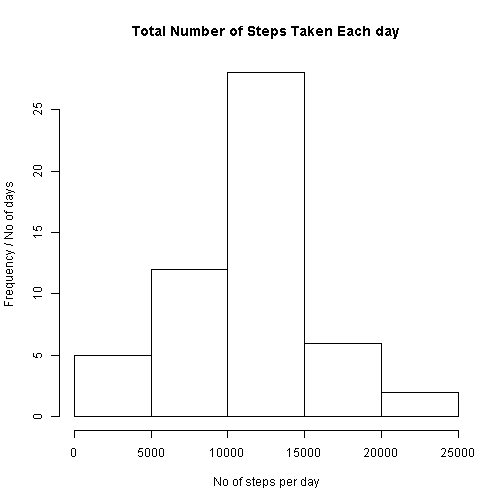

# Reproducible Research: Peer Assessment 1
---
<br/>

## Loading and preprocessing the data
<br/>

Read activity.csv into a data frame and view some rows

```r
df <- read.csv("activity.csv")
df[2303:2313, ]
```

```
##      steps       date interval
## 2303    NA 2012-10-08     2350
## 2304    NA 2012-10-08     2355
## 2305     0 2012-10-09        0
## 2306     0 2012-10-09        5
## 2307     0 2012-10-09       10
## 2308     0 2012-10-09       15
## 2309     0 2012-10-09       20
## 2310    13 2012-10-09       25
## 2311    28 2012-10-09       30
## 2312     0 2012-10-09       35
## 2313     0 2012-10-09       40
```

<br/>

And for good measure - a summary view...

```r
summary(df)
```

```
##      steps               date          interval   
##  Min.   :  0.0   2012-10-01:  288   Min.   :   0  
##  1st Qu.:  0.0   2012-10-02:  288   1st Qu.: 589  
##  Median :  0.0   2012-10-03:  288   Median :1178  
##  Mean   : 37.4   2012-10-04:  288   Mean   :1178  
##  3rd Qu.: 12.0   2012-10-05:  288   3rd Qu.:1766  
##  Max.   :806.0   2012-10-06:  288   Max.   :2355  
##  NA's   :2304    (Other)   :15840
```

<br/>

Structure of data frame df

```r
str(df)
```

```
## 'data.frame':	17568 obs. of  3 variables:
##  $ steps   : int  NA NA NA NA NA NA NA NA NA NA ...
##  $ date    : Factor w/ 61 levels "2012-10-01","2012-10-02",..: 1 1 1 1 1 1 1 1 1 1 ...
##  $ interval: int  0 5 10 15 20 25 30 35 40 45 ...
```

(note the NAs)
<br/>
<br/>

Create a new, clean data frame without the NAs, reset the factor  
levels and compare it to the structure of the original df

```r
cdf <- df[!is.na(df$steps), ]
cdf$date <- cdf$date[, drop = TRUE]
str(cdf)
```

```
## 'data.frame':	15264 obs. of  3 variables:
##  $ steps   : int  0 0 0 0 0 0 0 0 0 0 ...
##  $ date    : Factor w/ 53 levels "2012-10-02","2012-10-03",..: 1 1 1 1 1 1 1 1 1 1 ...
##  $ interval: int  0 5 10 15 20 25 30 35 40 45 ...
```

Nice and clean... We're good to go.

<br/>
## What is mean total number of steps taken per day?
<br/>
Histogram of the total number of steps taken each day

```r
hist(as.vector(tapply(cdf$steps, list(cdf$date), FUN = sum)), xlab = "No of steps per day", 
    ylab = "Frequency / No of days", main = "Total Number of Steps Taken Each day")
```

 

<br/>
Mean number of steps per day

```r
hist(as.vector(tapply(cdf$steps, list(cdf$date), FUN = mean)), xlab = "Mean steps per day", 
    ylab = "Frequency / No of days", main = "Average (Mean) Number of Steps Per day")
```

 

<br/>
The large number of zeroes (0) per day gives a median of 0 on day variables

```r
as.vector(tapply(cdf$steps, list(cdf$date), FUN = median))
```

```
##  [1] 0 0 0 0 0 0 0 0 0 0 0 0 0 0 0 0 0 0 0 0 0 0 0 0 0 0 0 0 0 0 0 0 0 0 0
## [36] 0 0 0 0 0 0 0 0 0 0 0 0 0 0 0 0 0 0
```

<br/>
## What is the average daily activity pattern?
<br/>

Time series plot of the 5-minute interval (x-axis) and the average number of steps taken, averaged across all days (y-axis)

```r
msteps <- aggregate(cdf$steps, by = list(cdf$interval), mean)
plot(msteps$Group.1, msteps$x, type = "l", main = "Mean no. of steps per interval accross all days", 
    xlab = "Daily 5 minute intervals", ylab = "No. of steps")
```

 

<br/>

Which 5-minute interval, on average across all the days in the dataset, contains the maximum number of steps?

```r
msteps$Group.1[which.max(msteps$x)]
```

```
## [1] 835
```

<br/>

## Imputing missing values


## Are there differences in activity patterns between weekdays and weekends?


